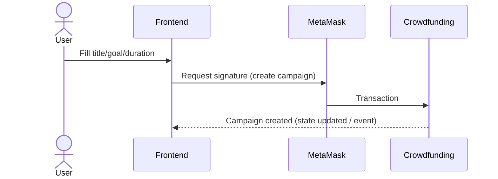
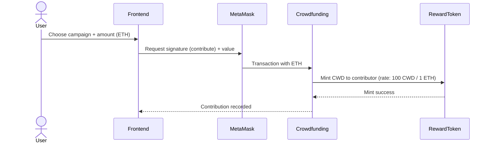
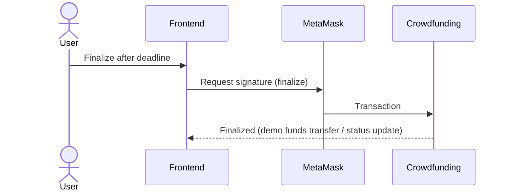

# Architecture — Decentralized Crowdfunding DApp

## System overview
This project is a simple Ethereum DApp that consists of:
- Smart contracts (Solidity): Crowdfunding + reward ERC-20 token
- Frontend (Vanilla JS): connects via MetaMask and interacts using ABI + contract addresses
- Hardhat deploy script: deploys contracts and exports ABI + addresses into `frontend/`

## Components

### 1) Frontend (Vanilla JS + MetaMask)
Responsibilities:
- Connect wallet (MetaMask)
- Read campaigns from Crowdfunding contract
- Send transactions: create campaign, contribute, finalize
- Display reward token balance (optional; depends on UI implementation)

Data dependencies (generated by deploy script):
- `frontend/contract-address.json` (addresses)
- `frontend/Crowdfunding.json` (ABI)
- `frontend/RewardToken.json` (ABI)

### 2) Smart contracts

#### Crowdfunding.sol
Responsibilities (conceptual):
- Store campaigns (creator, goal, deadline, raised, status)
- Accept ETH contributions (payable)
- Record contribution data
- Trigger reward minting on contribution
- Finalize campaign after deadline (demo logic)

#### RewardToken.sol (ERC-20, CWD)
Responsibilities (conceptual):
- ERC-20 token used as proof-of-contribution
- Mint tokens to contributors based on contribution amount
- Minting restricted (owner / Crowdfunding contract)

### 3) Deployment (Hardhat)
Responsibilities:
- Deploy RewardToken
- Deploy Crowdfunding (linked to RewardToken)
- Export ABI + addresses to frontend folder (no manual copy/paste)

## High-level diagram
```mermaid
flowchart LR
  U[User] --> FE[Frontend: HTML/CSS/JS]
  FE --> MM[MetaMask]
  MM --> RPC[(Hardhat node / Testnet RPC)]
  RPC --> CF[Crowdfunding.sol]
  RPC --> RT[RewardToken.sol (CWD)]
  DEP[Hardhat deploy.js] --> RPC
  DEP --> FE
```

## Main flows (Sequence)

### Create campaign


### Contribute ETH + receive CWD


### Finalize campaign


## Key design decisions (defense-ready)
- Vanilla JS frontend: minimal dependencies, easy to demo
- Hardhat local network: predictable defense environment
- Deploy script exports ABI + addresses automatically
============================================================
